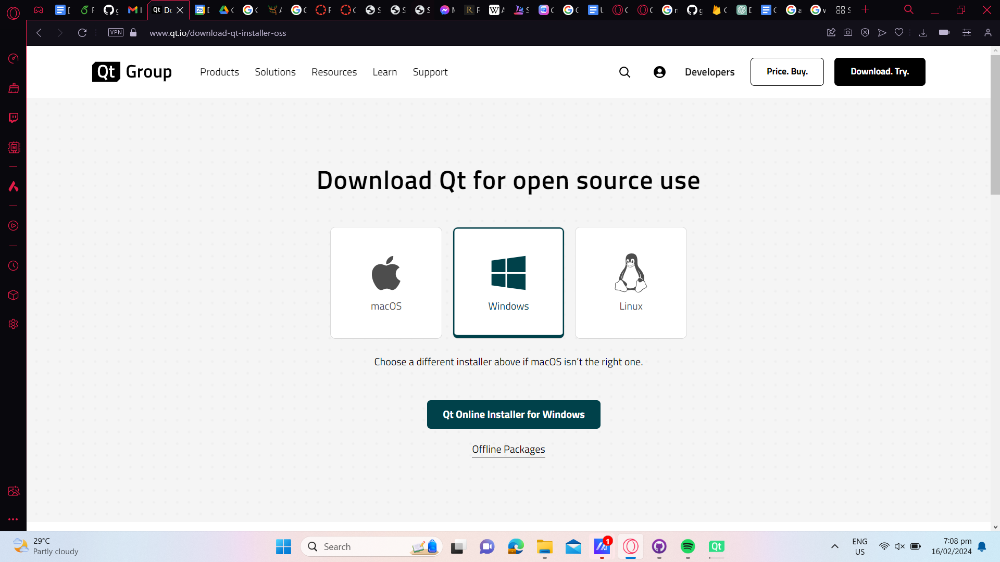

# Geting Started 

1. Clone the repository

2. Download QT 6.6 online installer [here](https://www.qt.io/download-qt-installer-oss)

3. Open the online installer and you'll be greeted with a login screen

4. If you don't have an account, create one by pressing **Sign Up** and fill up necessary details. If you have an account, proceed to step 5

5. Under **Installation Folder** there will be many installation options, choose **Qt 6.6 for desktop development**

6. Install Qt, it may take a while to install

7. Once its finished, open Qt Creator

8. Select **Open Project**

9. Find the project folder that you want to open and select the file with the file type `.pro`

10. Press **Configure Project**

11. Run the program

# Features

The user can select between 4 modes: (1) add a single ball, (2) add multiple balls with a uniform distance between a given start and end point, (3) add multiple balls with uniform distance between the given start Θ and end Θ, and (4) add multiple balls with a uniform difference between the given start and end velocities.

To access the different input options, you can click on the tabs that reference each option. To access the other options outside the view you can click on the arrows beside them. You can also hover over the tabs and scroll the mouse wheel. 

Additionally, the user may also use the **Explorer Mode**. In this mode, the user cannot spawn balls until he/she exits explorer mode. To use the explorer mode, the user should click on the "start" button on the bottom right side of the screen. This spawns a sprite initially set to the bottom left of the screen. The view is also zoomed in so the sprite is at the center of the view. When using explorer mode, you can click on the movement keys on the right side to move the sprite around. Any balls that already exist and are moving around will be seen in the explorer mode if they are within the range of the sprite view. If the user exits explorer mode after moving around, the sprite will disappear and the view is zoomed out again to see the entire field. If the user returns to the explorer mode, the sprite will reappear at its previous location. 

The application also displays an FPS counter with the base frame-rate being 120 FPS. 

**(1) Single Ball Input**
| Input | Description |
|-------|-------------|
|Ball Location (X) | X-Position of the Ball |
|Ball Location (Y) | Y-Position of the Ball |
|Ball Velocity | Speed of the Ball |
|Ball Direction | Movement Direction of the Ball |

**(2) Multiple Balls Input (Different Positions):**
| Input | Description |
|-------|-------------|
|Initial Ball Location (X) | Starting X-Position in the Range |
|Final Ball Location (X) | Ending X-Position in the Range |
|Initial Ball Location (Y) | Starting Y-Position in the Range |
|Final Ball Location (Y) | Ending Y-Position in the Range |
|Ball Velocity | Speed of the Balls |
|Ball Direction | Movement Direction of the Balls |
|Number of Balls | Number of Balls to be Added|

**(3) Multiple Balls Input (Different Movement Directions):**
| Input | Description |
|-------|-------------|
|Initial Direction | Starting Movement Direction in the Range |
|Final Direction | Ending Movement Direction in the Range |
|Ball Location (X) | X-Position of the Balls |
|Ball Location (Y) | Y-Position of the Balls |
|Ball Velocity | Speed of the Balls |
|Number of Balls | Number of Balls to be Added|

**(4) Multiple Balls Input (Different Velocities):**
| Input | Description |
|-------|-------------|
|Initial Velocity | Starting Velocity in the Range |
|Final Velocity | Ending Velocity in the Range |
|Ball Location (X) | X-Position of the Balls |
|Ball Location (Y) | Y-Position of the Balls |
|Ball Direction | Movement Direction of the Balls |
|Number of Balls | Number of Balls to be Added|

# Important Information

- The application may occasionally crash when adding balls. You can rerun the application again with the same input to retest the add-on configuration.

- Please only input X-position from 0 to 1280, and Y-positions from 0 to 720. 
    - If the ball spawns outside the range, it may be placed inside the border wall which may cause the ball to slide of the wall.

- Please input velocities from 0 to 15
    - Take note that picking higher speeds may cause the ball to leave a "trail". 
    - Inputting negative velocities will cause the wall collision to fail. 
    - Inputting velocities over 20 may also cause the ball to pass through the wall instead of bouncing on it.

- Movement Directions starts on the positive X and goes counter-clockwise. 
    - 0 will cause the ball to move rightward
    - 90 will cause the ball to move upwards
    - 180 causes the ball to move leftwards
    - 270 causes the ball to go downwards

- If the frame rate drops significantly, the ball movement/collision may be affected.

- If you see the balls leave a trail, this is only a UI glitch, you can remove it by reloading the application 
    - (ie. minimize and reopen the app, or clicking on a different app and clicking back to the program to reload the scene)
    - Due to the increased size of the balls after zooming in using explorer mode, the balls are likely to leave a "trail" in the sprite view.

# Authors

Caoile, Sean Iverson
Lim, Aurelius Justin
Tan, Gavin Matthew 
Yongco, Denzel Bryan
